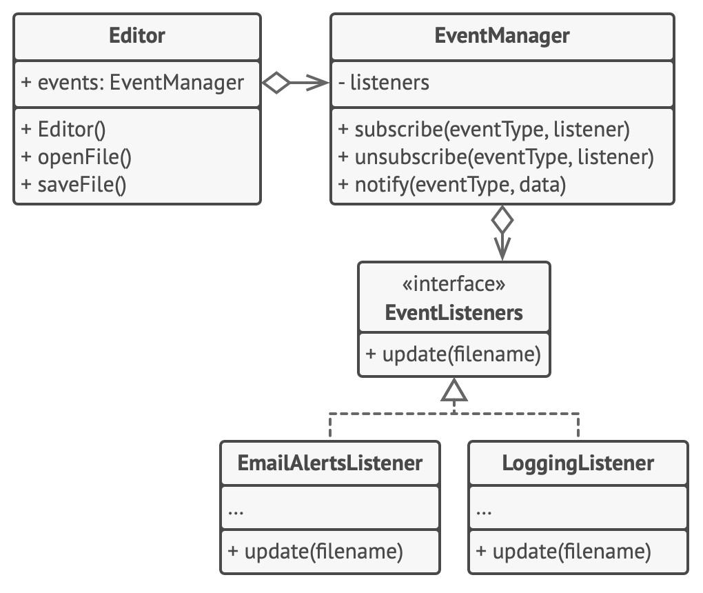

# Observer

Let you define a subscription mechanism to notify multiple objects about any events that happen to the object they're observing.


1. The **Publisher** issues events of interest to other objects.These events occur when the publisher
changes its state or execute some behaviors. Publishers contain a subscription infrastructure that lets new subscribers join
or leave the list.
2. When a new event happens, the publisher goes over the subscription list and calls the notification method declared in the
subscriber interface on on each subscriber object.
3. The **Subscriber** interface declares the notification interface. In most cases, it consists of a single **update** method.
The method let the publisher pass some event details along with the update.
4. **Concrete Subscribers** perform some actions in response to notifications issue by the publisher. All of these classes 
must implement the same interface so the publisher isn't coupled to concrete classes.



```
// The base publisher class includes subscription management
// code and notification methods.

class EventManager is
  private field listeners: hash map of event types and listeners

  method subscribe(eventType, listener) is
    listeners.add(eventType, listener)
  
  method unsubscribe(eventType, listener) is
    listeners.remove(eventType, listener)
  
  method notify(eventType, data) is
    foreach(listener in listeners.of(eventType)) do
      listener.update(data)
  
// The concrete publisher contains real business logic that's
// interesting for some subscribers. We could derive this class from the base publisher (Editor.class),
// but isn't always possible in real life because the concrete publisher might already be a subclass. In this case, you can
// patch the subscription logic with composition, as we did here:

class Editor is
  public field events: EventManager
  private field file: File

  constructor Editor() is
    events = new EventManager()
  
  // Methods of business logic can notify subscribers about changes
  method openFile(path) is
    this.file = new File(path)
    events.notify("open", file.name)
  
  method saveFile() is
    file.write()
    events.notify("save", file.name)
  

// Here's the subscriber interface
interface EventListener is
  method update(filename)

class LoggingListener implements EventListener is
  private field log : File
  private field message: string

  constructor LoggingListener(log_filename, message) is
    this.log = new File(log_filename)
    this.message = message

  method update(filename) is
    log.write(replace('%s',filename,message))

class EmailAlertsListener implements EventListener is
  private field email: string
  private field message: string

  constructor EmailAlertsListener(email, message) is
    this.email = email
    this.message = message

  method update(filename) is
  system.email(email, replace('%s',filename,message))

// An application can configure publishers and subscribers at
// runtime.
class Application is
    method config() is
        editor = new Editor()

        logger = new LoggingListener(
            "/path/to/log.txt",
            "Someone has opened the file: %s")
        editor.events.subscribe("open", logger)

        emailAlerts = new EmailAlertsListener(
            "admin@example.com",
            "Someone has changed the file: %s")
        editor.events.subscribe("save", emailAlerts)  
```