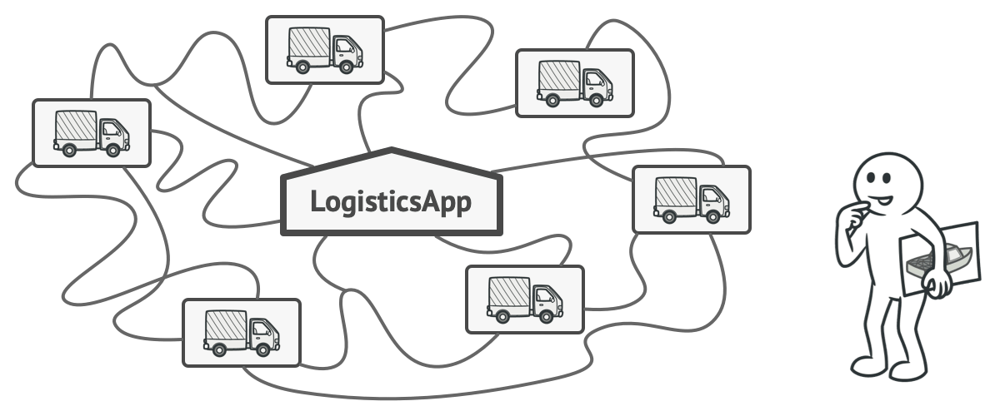
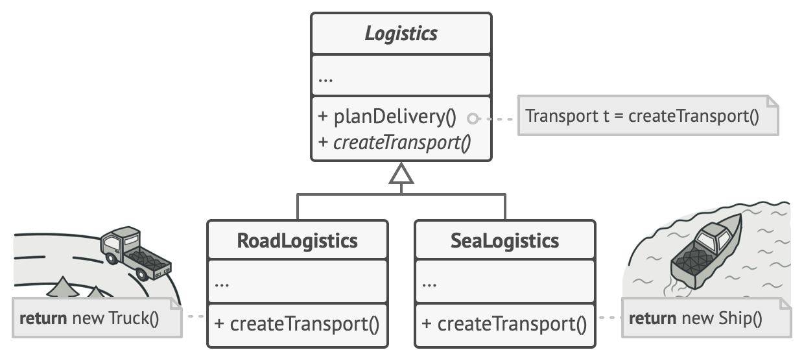
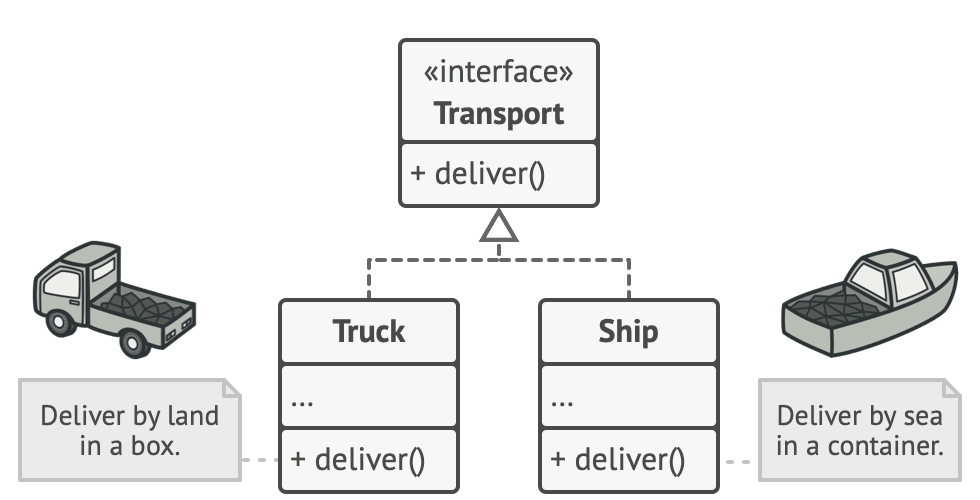
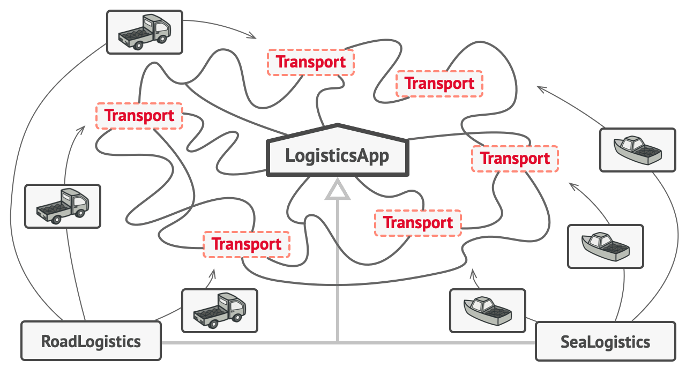
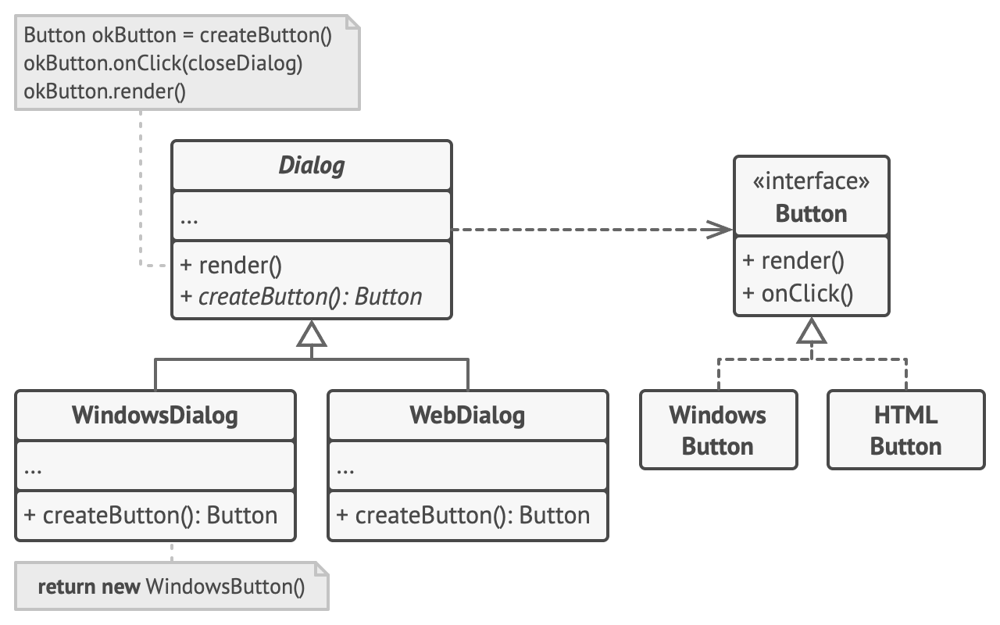

# Factory Method

Provides an interface for creating objects in a superclass, but allows subclasses to alter the type of object that will be created.

## Problem 

You are creating a logistics management application. The first version can only handle transportation by trucks, so the bulk 
of your code lives inside the `Truck` class. 



Adding additional transportation means will need codebase changes. 

## Solution

Adding a `Factory Method` for creating the objects, instead of the direct object construction by using the `new` operator. 
Objects created by a factory method also called **Products**.



Now is possible to override the method in a subclass and change the class of products being created by the method.

There is a slight limitation though: subclasses may return different type of products, only of these products have a common
base class or interface. Also, the factory method in the base class should have its return type declared as this interface.



`Truck` and `Ship` classes implement the `Transport` interface, which declares a method called `deliver`, trucks deliver 
cargo by land, while ships deliver cargo by sea. The factory method in the `RoadLogistics` class returns `Truck` objects
whereas the factory method in the `SeaLogistics` class return `Ship` objects. 



## Structure

1. The **Product** declares the interface, which is common to all objects that can be produced by the creator and its subclasses.
2. **Concrete Products** are different implementations of the product interface.
3. The **Creator** class declares the factory method that returns new product objects.
    1. You can declare the factory method as `abstract` to force all subclasses to implement their own versions of the method. 
4. **Concrete Creators** override the base factory method, so it returns a different type of product.

**Note:** `Factory method doesn't have to create new instances all the time. It can also return existing objects from cache, an object pool, or another source.`


## Pseudocode

This example illustrates Factory Method can be used for creating cross-platform UI elements without coupling the client code to
concrete UI classes.



The base `Dialog` class uses different UI elements to render its window. Under different operating systems the elements may 
look different, but they still behave consistently. A button in windows is still a button in Linux.

`Dialog` class must work with abstract buttons: a base class or interface that all concrete buttons follow.

The creator class declares the factory method, that must return an object of a product class.
```
class Dialog is
    // The creator may also provide some default implementation
    // of the factory method.
    abstract method createButton():Button

    // Note that, despite its name, the creator's primary
    // responsibility isn't creating products. It usually
    // contains some core business logic that relies on product
    // objects returned by the factory method. Subclasses can
    // indirectly change that business logic by overriding the
    // factory method and returning a different type of product
    // from it.
    method render() is
        // Call the factory method to create a product object.
        Button okButton = createButton()
        // Now use the product.
        okButton.onClick(closeDialog)
        okButton.render()
```

Concrete creators override the factory method to change the resulting product's type.
```
class WindowsDialog extends Dialog is
    method createButton():Button is
        return new WindowsButton()

class WebDialog extends Dialog is
    method createButton():Button is
        return new HTMLButton()
```

The product interface declares the operations that all concrete products must implement.
```
interface Button is
    method render()
    method onClick(f
```
Concrete products provide various implementations of the product interface.
```
class WindowsButton implements Button is
    method render(a, b) is
        // Render a button in Windows style.
    method onClick(f) is
        // Bind a native OS click event.

class HTMLButton implements Button is
    method render(a, b) is
        // Return an HTML representation of a button.
    method onClick(f) is
        // Bind a web browser click event.
```

```
class Application is
    field dialog: Dialog

    // The application picks a creator's type depending on the
    // current configuration or environment settings.
    method initialize() is
        config = readApplicationConfigFile()

        if (config.OS == "Windows") then
            dialog = new WindowsDialog()
        else if (config.OS == "Web") then
            dialog = new WebDialog()
        else
            throw new Exception("Error! Unknown operating system.")

    // The client code works with an instance of a concrete
    // creator, albeit through its base interface. As long as
    // the client keeps working with the creator via the base
    // interface, you can pass it any creator's subclass.
    method main() is
        this.initialize()
        dialog.render()
```

## Applicability

- Use the Factory Method when you don’t know beforehand the exact types and dependencies of the objects your code should work with.
- Use the Factory Method when you want to provide users of your library or framework with a way to extend its internal components.
- Use the Factory Method when you want to save system resources by reusing existing objects instead of rebuilding them each time.
    - First, you need to create some storage to keep track of all of the created objects. 
    - When someone requests an object, the program should look for a free object inside that pool.
    - then return it to the client code.
    - If there are no free objects, the program should create a new one (and add it to the pool). 
