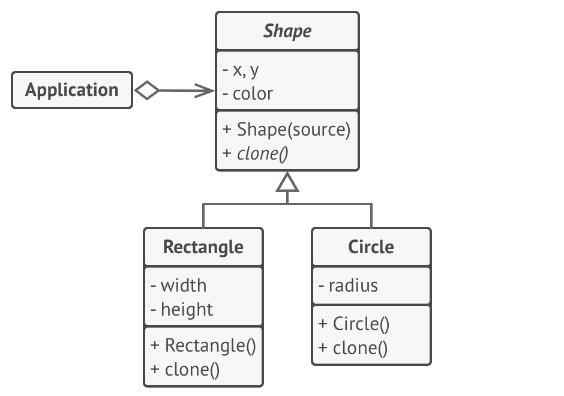

# Prototype

Lets you copy existing objects without making the code dependant on their classes.

## Problem

There is an object that needs to be copied, so the first step is to create a new instance of the same class, then go through 
all the fields and copy their values into the new object. 

But what if some fields are not reachable outside the object itself?

Since is necessary to know the object's class to create a duplicate, your code becomes dependent on tha class. Also, sometimes
only is possible to know the interface that the object follows, but not its concrete class, when, for example, a parameter 
in a method accepts any objects that follow some interface. 

## Solution

Prototype delegates the cloning process to the actual objects that are being cloned. The pattern declares a common interface 
for all the objects that support cloning. This interface lets you clone an object without coupling your code to the object's class.

Usually, such an interface contains just a single clone method.

An object that supports cloning is called a prototype. When your objects have dozens of fields and hundreds of possible 
configurations, cloning them might serve as alternative to subclassing.

## Structure


1. The **Prototype** interface declares the cloning methods.
2. The **ConcretePrototype** class implements the cloning method. Also handles copying the original object's data to the clone.
3. The **Client** can produce a copy of any object that follows the prototype interface.

## Pseudocode



All Shape classes follow the same interface, which provides a cloning method. A subclass may call the parent's cloning method
before copying its own field values to the resulting object.

```
// Base prototype.
abstract class Shape is
    field X: int
    field Y: int
    field color: string

    // A regular constructor.
    constructor Shape() is
        // ...

    // The prototype constructor. A fresh object is initialized
    // with values from the existing object.
    constructor Shape(source: Shape) is
        this()
        this.X = source.X
        this.Y = source.Y
        this.color = source.color

    // The clone operation returns one of the Shape subclasses.
    abstract method clone():Shape
```

Concrete prototype. The cloning method creates a new object in one go by calling the constructor of the current class
and passing the current object as the constructor's argument.
```
class Rectangle extends Shape is
    field width: int
    field height: int

    constructor Rectangle(source: Rectangle) is
        // A parent constructor call is needed to copy private
        // fields defined in the parent class.
        super(source)
        this.width = source.width
        this.height = source.height

    method clone():Shape is
        return new Rectangle(this)


class Circle extends Shape is
    field radius: int

    constructor Circle(source: Circle) is
        super(source)
        this.radius = source.radius

    method clone():Shape is
        return new Circle(this)
```

Somewhere in the client code.

```
class Application is
    field shapes: array of Shape

    constructor Application() is
        Circle circle = new Circle()
        circle.X = 10
        circle.Y = 10
        circle.radius = 20
        shapes.add(circle)

        Circle anotherCircle = circle.clone()
        shapes.add(anotherCircle)

        Rectangle rectangle = new Rectangle()
        rectangle.width = 10
        rectangle.height = 20
        shapes.add(rectangle)

    method businessLogic() is
        // Prototype rocks because it lets you produce a copy of
        // an object without knowing anything about its type.
        Array shapesCopy = new Array of Shapes.

        // For instance, we don't know the exact elements in the
        // shapes array. All we know is that they are all
        // shapes. But thanks to polymorphism, when we call the
        // `clone` method on a shape the program checks its real
        // class and runs the appropriate clone method defined
        // in that class. That's why we get proper clones
        // instead of a set of simple Shape objects.
        foreach (s in shapes) do
            shapesCopy.add(s.clone())

        // The `shapesCopy` array contains exact copies of the
        // `shape` array's children.
```