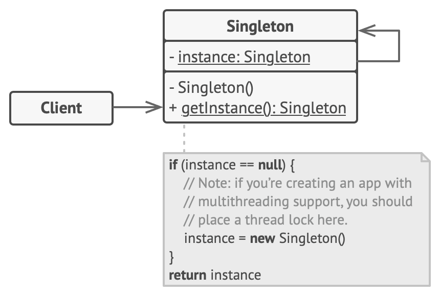

# Singleton

Lets you ensure that a class has only one instance, while providing a global access point to this instance.

## Problem

Ensure that a class has just a single instance. The most common reason for this is to control access to some shared 
resource-for example, a database or a file.

This behavior is impossible to implement with a regular constructor since a constructor must always return a new object by design.


## Solution 

- Make the default constructor private, to prevent other objects from using the new operator with a Singleton class.
- Create a static creation method that acts as a constructor. Behind the scenes the static method will create an instance 
and store in a static field, this field will be returned each time a new instance is requested.

## Structure



The **Singleton** class declares the static method getInstance that returns the same instance of its own class.
The Singleton's constructor should be hidden from the client code. Calling the **getInstance** method should be the only way 
of getting a Singleton object.

## Pseudocode

The Database class defines the `getInstance` method that lets clients access the same instance of a database connection 
throughout the program.

```
class Database is
    private static field instance: Database

    private constructor Database() is
        // Some initialization code, such as the actual
        // connection to a database server.
        // ...

    public static method getInstance() is
        if (Database.instance == null) then
            acquireThreadLock() and then
                // Ensure that the instance hasn't yet been
                // initialized by another thread while this one
                // has been waiting for the lock's release.
                if (Database.instance == null) then
                    Database.instance = new Database()
        return Database.instance

    // Finally, any singleton should define some business logic
    // which can be executed on its instance.
    public method query(sql) is
        // For instance, all database queries of an app go
        // through this method. Therefore, you can place
        // throttling or caching logic here.
        // ...
```

Application class makes usage of the Singleton instance.

```
class Application is
    method main() is
        Database foo = Database.getInstance()
        foo.query("SELECT ...")
        // ...
        Database bar = Database.getInstance()
        bar.query("SELECT ...")
        // The variable `bar` will contain the same object as
        // the variable `foo`.
```

## Why Singleton breaks open/closed principle?

For a class to be "open" it must be possible to inherit from it. Inheritance is an `is-a` relationship. If you inherit from
a singleton-class the instances of the child-classes are also instances of the parent class due to the `is-a` relationship, 
meaning that you can have suddenly multiple instances of the singleton class.

If the singleton class inhibits inheritance, it's no longer "open".

