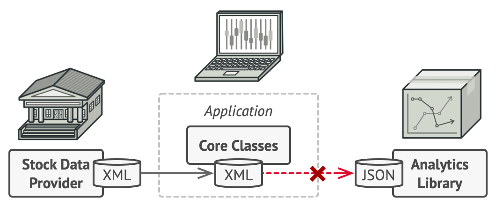
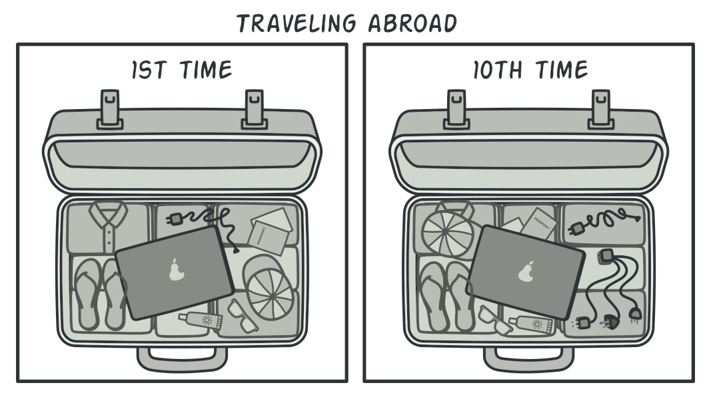
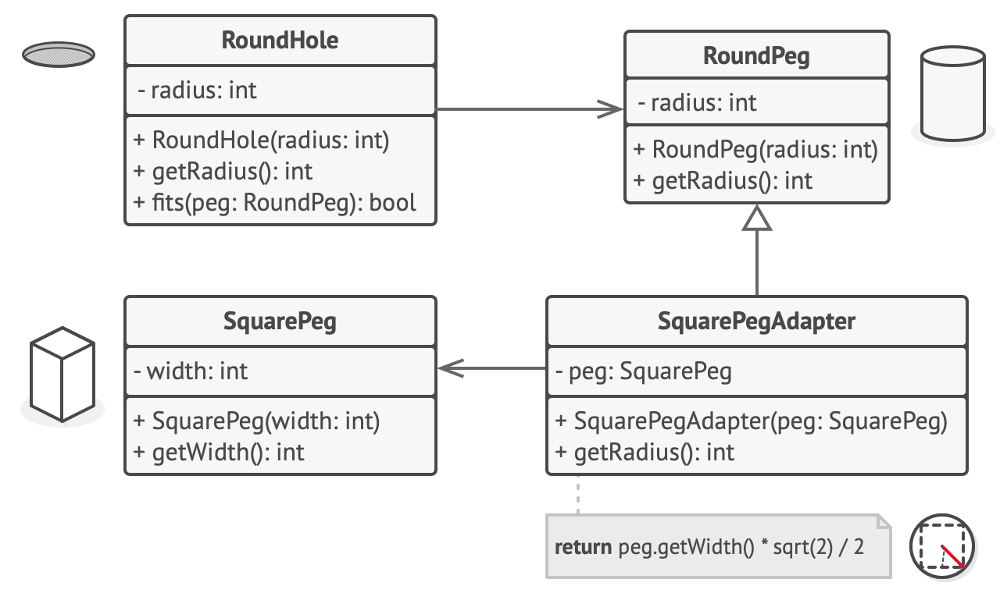

# Adapter  
Also known as **Wrapper**

## Problem

You are creating an app it downloads stock data from multiple sources in XML format and then displays nice-looking charts 
and diagrams for the user. At some point you decide to improve the app by integrating a smart 3rd-party analytics library. 
But there's a catch: the analytics library only works with data in JSON format.


You could change the library to work with XML but it might break some existing code that relies on the library. 
And worse, you might not have access to the library source code, making the task kind of impossible.

## Solution
Create an Adapter, this is a special object that converts the interface of one object so that another object can understand it.

An Adapter wraps one of the objects to hide the complexity of conversion happening behind the scenes. The wrapped object 
isn't even aware of the Adapter. You can wrap object that operates with meters and kilometers with an adapter that converts 
all the data to imperial units such as feet and miles.

Adapters not only can convert data into various formats but can also help objects with different interfaces collaborate:

1. Adapter gets an interface, compatible with one of the existing objects.
2. Using this interface the existing object can safely call the adapter's methods.
3. Upon receiving a call, the adapter passes the request to the second object, but in a format and order that the second object expects.

Sometimes is possible to create a two-way adapter that convert the calls in both directions.


## Analogy

When you travel from the US to Europe for the first time, you may get a surprise when trying to charge your laptop. 
The power plug and sockets standards are different in different countries. That’s why your US plug won’t fit a German socket. 
The problem can be solved by using a power plug adapter that has the American-style socket and the European-style plug.

## Structure
The implementation uses the object composition principle: the adapter implements the interface of one object and wraps the other one.


1. The **Client** is a class that contains the existing business logic of the program.
2. The **Client Interface** describes a protocol that other classes must follow to be able to collaborate with the client code.
3. The **Service** is some useful class (usually 3rd-party library or legacy). The client can't use this class directly 
because it has an incompatible interface. 
4. The **Adapter** is a class that's able to work with both the **Client** and the **Service**: it implements the client interface,
while wrapping the service object. The adapter receives calls from the client via the adapter interface and translates them 
into  call to the wrapped service object in a format it can understand.
5. The client code doesn't get coupled to the concrete adapter class as long as it works with the adapter via the client interface. 
Thanks to this, you can introduce new types of adapters into the program without breaking the existing client code. 
This can be useful when the interface of the service class gets changed or replaced: you can just create a new adapter 
class without changing the client code.

## Pseudocode
The **Adapter** pattern is based on the classic conflict between square pegs and round holes.


The **Adapter** pretends to be a round peg, with a radius equal to a half of the square's diameter.

Say you have two classes with compatible interfaces: **RoundHole** and **RoundPeg**.
```
class RoundHole is
    constructor RoundHole(radius) { ... }

    method getRadius() is
        // Return the radius of the hole.

    method fits(peg: RoundPeg) is
        return this.getRadius() >= peg.getRadius()

class RoundPeg is
    constructor RoundPeg(radius) { ... }

    method getRadius() is
        // Return the radius of the peg.
```

But there's an incompatible class: **SquarePeg**
```
class SquarePeg is
    constructor SquarePeg(width) { ... }

    method getWidth() is
        // Return the square peg width.
```
An **Adapter** class lets you fit square pegs into round holes. It extends the **RoundPeg** class to let the adapter objects 
act as round pegs.
```
class SquarePegAdapter extends RoundPeg is
    // In reality, the adapter contains an instance of the
    // SquarePeg class.
    private field peg: SquarePeg

    constructor SquarePegAdapter(peg: SquarePeg) is
        this.peg = peg

    method getRadius() is
        // The adapter pretends that it's a round peg with a
        // radius that could fit the square peg that the adapter
        // actually wraps.
        return peg.getWidth() * Math.sqrt(2) / 2
```
Somewhere in the client code.
```
hole = new RoundHole(5)
rpeg = new RoundPeg(5)
hole.fits(rpeg) // true

small_sqpeg = new SquarePeg(5)
large_sqpeg = new SquarePeg(10)
hole.fits(small_sqpeg) // this won't compile (incompatible types)

small_sqpeg_adapter = new SquarePegAdapter(small_sqpeg)
large_sqpeg_adapter = new SquarePegAdapter(large_sqpeg)
hole.fits(small_sqpeg_adapter) // true
hole.fits(large_sqpeg_adapter) // false
```

## Applicability
When you want to use some existing class, but its interface isn't compatible with the rest of your code.
> The Adapter pattern lets you create a middle-layer class that serves as a translator between your code and a legacy class
, a 3rd-party class or any other class with a weird interface.

When you want to reuse several existing subclasses that lack some common functionality that can't be added to the superclass.
> You could extend each subclass and put the missing functionality into new child classes. However, you'll need to duplicate
code across the subclasses (terrible smell).

The much more elegant solution would be t put some missing functionality into an adapter class. Then wrap missing 
features inside the adapter, gaining needed features dynamically. For this to work, the target classes must have a common 
interface, and the adapter's field should follow that interface (**Decorator**).

There are some standard Adapters in Java core libraries:

- java.util.Arrays#asList()
- java.util.Collections#list()
- java.io.InputStreamReader(InputStream) (returns a Reader object).