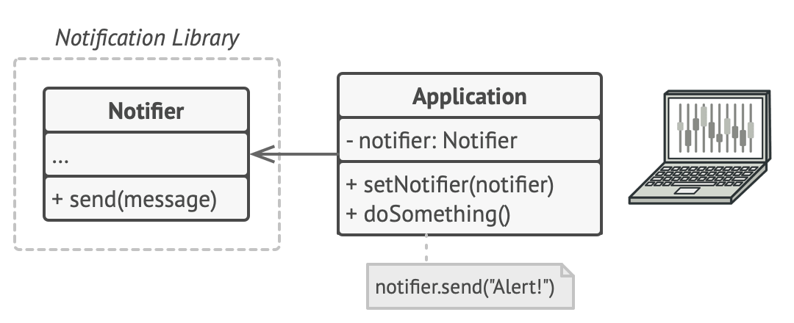
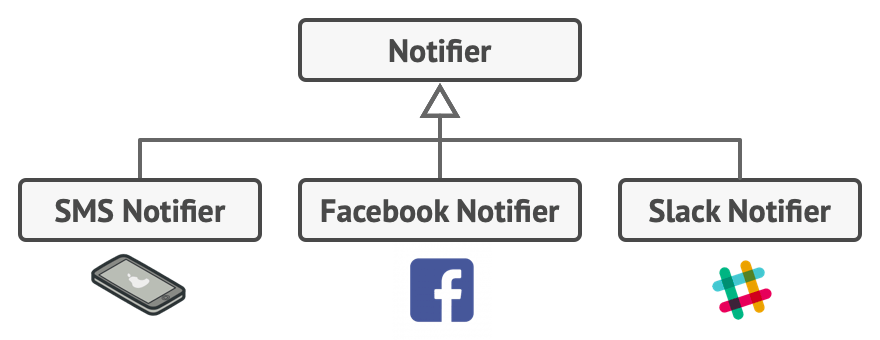
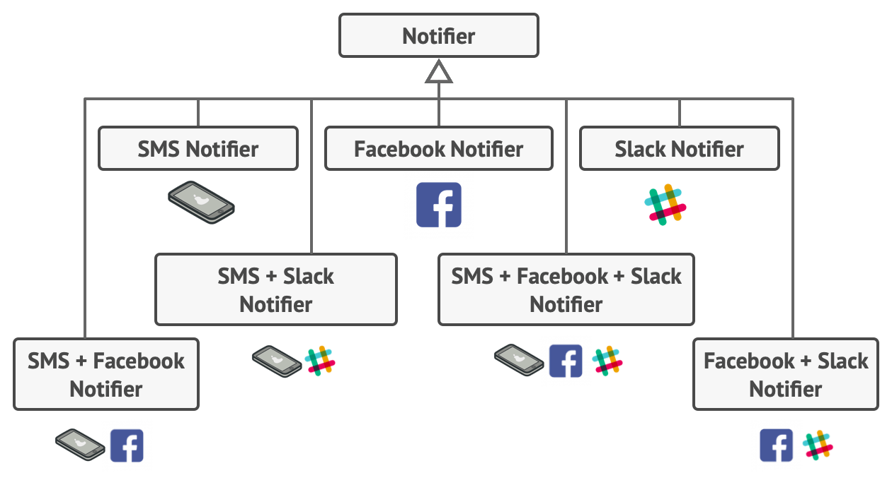
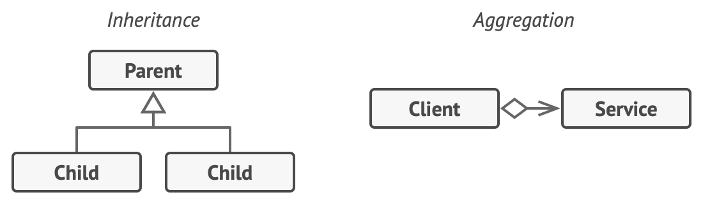
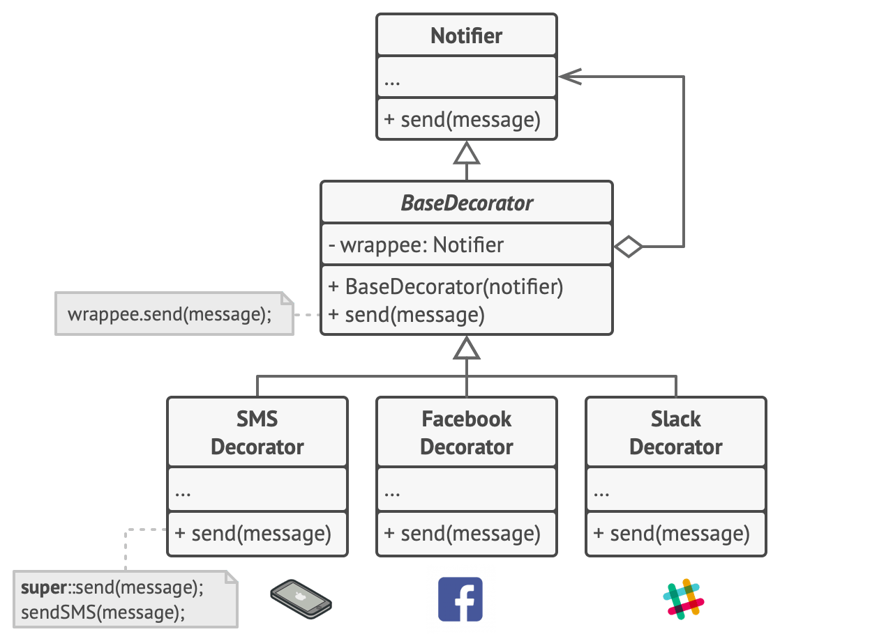
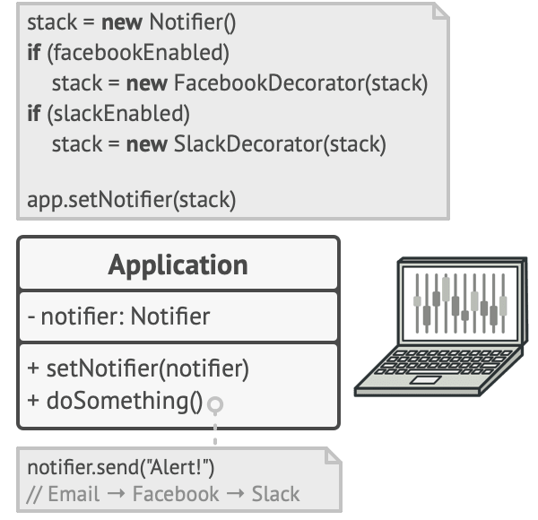
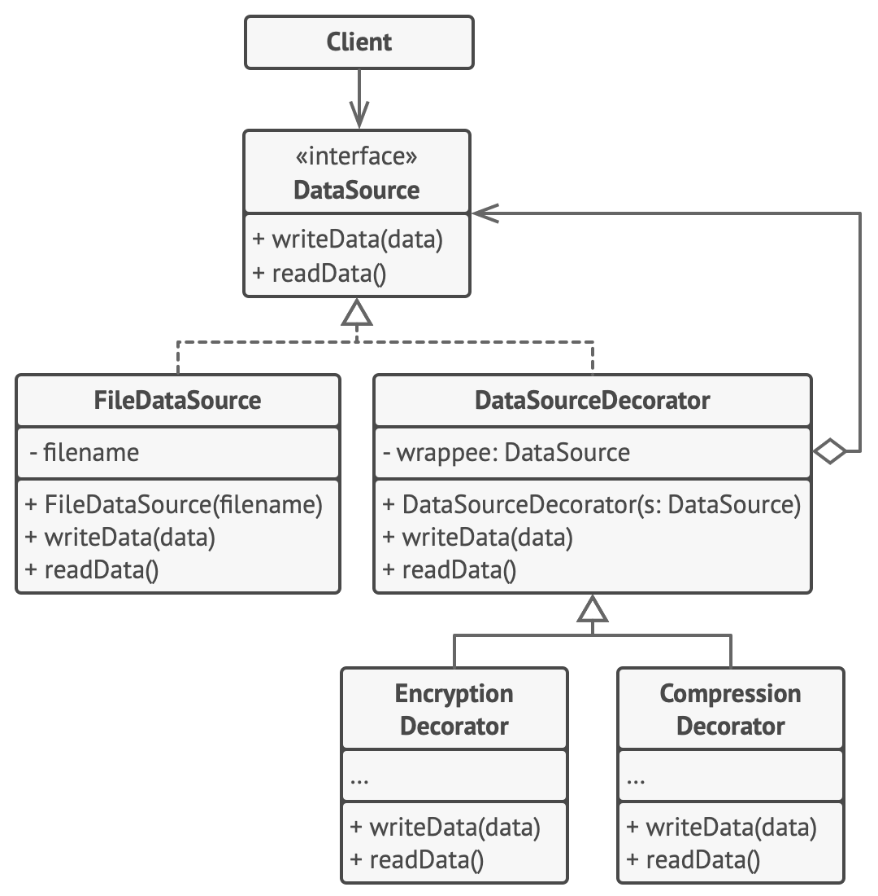

# Decorator

Lets you attach new behaviors to objects by placing them inside a special wrapper objects that contain the behaviors.

## Problem

Imagine you're working on a new notification app, that let other programs notify their users about important events.

The initial version of the app was based on the **Notifier** class, which has a few attributes and a unique **send** method.

The **send** method will accept a list of emails (via constructor), a third-party app which acted as a client was 
supposed to create and configure the notifier object once, and then unse it each time something important happened.



At some point you realize that some users need more than just email notifications. Some of them would like SMS notifications,
others Facebook notifications and some others prefer Slack notifications.



 Extending the **Notifier** class will look as the perfect option, but what if someone wants to receive multiple
notifications all at once (his house in on fire). You added even more specialized classes for each case, that will bloat the 
code immensely, not only the library but the client code as well.



## Solution

Extending classes is the first thing that comes to mind when you need to alter an object.

- **Inheritance is static**. You can't alter the behavior of an existing object at runtime. You can only replace the whole object.
With another one created from a different subclass.
- **Subclasses can just have one parent class** (in most languages).

By using Aggregation or Composition.
- **Aggregation:**  Object **A** contains objects **B**. **B** can't live without **A**.
- **Composition:** Object **A** consists of objects **B**; **A** manages lifecycle of **B**. **B** can't live without **A**.

With this new approach the "linked" object could be substituted. Changing the behavior of the container at runtime. 
An object could use the behavior of various classes, having references to multiple objects and delegating them this kind of work.



"**Wrapper**" is the alternative name for decorator pattern, A wrapper is an object that can be linked with some target object.
The wrapper contains the same set of methods as the target and delegates to it all the requests it receives. However, it may alter
the result by doing something before or after the request is processed.

Wrapper implements the same interface as the wrapped object. That's why from the client's perspective these objects are identical.
Makes the wrapper's reference accept any object that follows that interface. Thiswill let you cover an object in multiple wrappers,
adding the combined behavior of all the wrappers to it.

In the **Notificator** example turn all other notification methods into decorators.



The client code would need to wrap a basic notifier object into a set of decorators that matches the client's preferences. 
The resulting object will be structured as a stack.



The last decorator in the stack would be the object that the client actually works with. Since all decorator implement the 
same interface as the base notifier the actual notifier object "pure" or decorated one.

## Structure

1. The **Component** declares the common interface for both wrappers and wrapped objects.
2. **Concrete Component* is a class of objects being wrapped. It defines the basic behavior, which can be altered by decorators.
3. The **Base Decorator** class has a field for referencing a wrapped object. The fields type should be declared as the 
**Component interface** so it can contain both concrete components and decorators. The base decorator delegates all operations 
to the wrapped object.
4. **Concrete decorators** add behaviors dynamically to the component, **Concrete decorators** override methods of 
the base decorator, and executes their behavior either before or after calling the parent method.


## Pseudocode

The **Decorator** pattern lets compress and encrypt sensitive data independently of the code that actually uses this data.



- Just before the data is written to the disk the decorators encrypt and compress it.The original class writes the encrypted
and protected data to the file without knowing about the change.
- Right after the data is read from the disk it suffers the inverse process, decompression and decryption.

Decorators should implement the DataSource interface, make them interchangeable in the client code, and alter its behavior.
```
interface DataSource is
    method writeData(data)
    method readData():data
```

Concrete components provide default implementations for the operations. There could be multiple concrete objects.

```
class FileDataSource implements DataSource is
    constructor FileDataSource(filename) { ... }

    method writeData(data) is
        // Write data to file.

    method readData():data is
        // Read data from file.
```

The base decorator class implements the same interface as the other concrete classes. The primary purpose for this class is 
to define a wrapping interface for all the decorators. The default implementation of the wrapping code, might include a field
for storing a wrapped component and the means to initialize it.

```
class DataSourceDecorator implements DataSource is
    protected field wrappee: DataSource

    constructor DataSourceDecorator(source: DataSource) is
        wrappee = source

    // The base decorator simply delegates all work to the
    // wrapped component. Extra behaviors can be added in
    // concrete decorators.
    method writeData(data) is
        wrappee.writeData(data)

    // Concrete decorators may call the parent implementation of
    // the operation instead of calling the wrapped object
    // directly. This approach simplifies extension of decorator
    // classes.
    method readData():data is
        return wrappee.readData()
```

Concrete decorators must call methods on the wrapped object, but may add something of their own to the result. Decorators could
add behavior before or after the call to the wrapped object.

```
class EncryptionDecorator extends DataSourceDecorator is
    method writeData(data) is
        // 1. Encrypt passed data.
        // 2. Pass encrypted data to the wrappee's writeData
        // method.

    method readData():data is
        // 1. Get data from the wrappee's readData method.
        // 2. Try to decrypt it if it's encrypted.
        // 3. Return the result.

// You can wrap objects in several layers of decorators.
class CompressionDecorator extends DataSourceDecorator is
    method writeData(data) is
        // 1. Compress passed data.
        // 2. Pass compressed data to the wrappee's writeData
        // method.

    method readData():data is
        // 1. Get data from the wrappee's readData method.
        // 2. Try to decompress it if it's compressed.
        // 3. Return the result.
```

Example: A simple example of a decorator assembly.
```
class Application is
    method dumbUsageExample() is
        source = new FileDataSource("somefile.dat")
        source.writeData(salaryRecords)
        // The target file has been written with plain data.

        source = new CompressionDecorator(source)
        source.writeData(salaryRecords)
        // The target file has been written with compressed
        // data.

        source = new EncryptionDecorator(source)
        // The source variable now contains this:
        // Encryption > Compression > FileDataSource
        source.writeData(salaryRecords)
        // The file has been written with compressed and
        // encrypted data.
```

## Applicability

- Use Decorator pattern when you need to be able to add extra behaviors to objects at runtime without breaking the code that 
uses these objects.
- When it's awkward or not possible to extend an object's behavior using inheritance.
