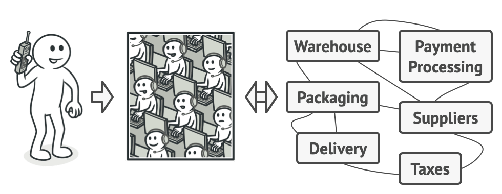
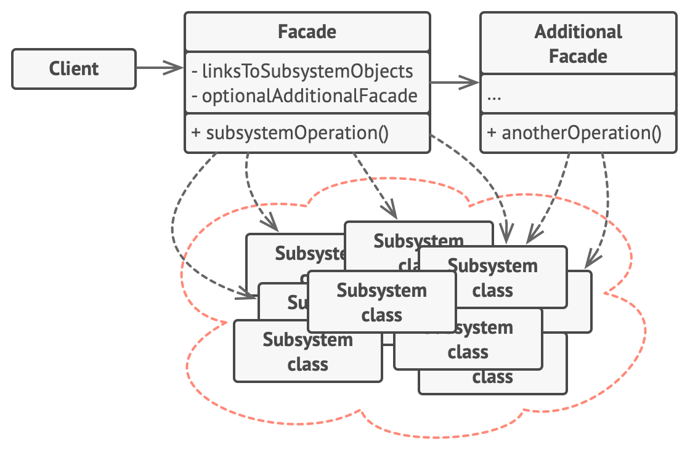
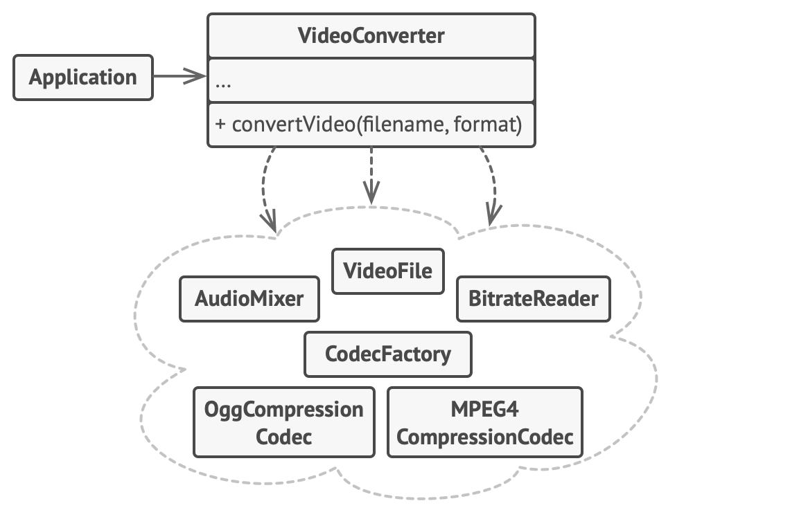

# Facade

Provides a simplified interface to a library, framework or anu other complex set of classes.

## Problem

Imagine you lust make your code wotk with a sophisticated set of objects provided by a sophisticated library/framework. 
You'll need to initialize all of those objects, keep track of dependencies, execute methods in the correct order and so on.

As a result, the business logic of your classes will be tightly coupled to the implementation details of 3rd-party classes,
making it hard to comprehend and maintain.

## Solution

A facade is a class that provides a simple interface to a complex system. It might provide a limited functionality in comparison 
to working with the subsystem directly. However, it contains the features that clients care about, i.e. using that tiny part 
instead of the whole subsystem.



When you call a shop to place a phone order, an operator is your facade to all services and departments of the shop. 
The operator provides a voice interface to the ordering system, payment gateways, and various delivery services.

## Structure



1. The **Facade** provides convenient access to a particular part of the subsystem's functionality. It knows where to direct 
the client requests and how to operate all the moving parts.
2. An **Additional Facade** can be created to prevent polluting a single facade with unrelated features (making it another complex structure).
3. The **Complex Subsystem** consists of several objects, you have to deep dive into the subsystem's implementation details,
such as initializing objects in the correct order and providing data properly formatted.
4. The **Client** uses the facade instead of calling the subsystem objects directly.

## Pseudocode



Instead of making your code work with dozens of the framework classes directly, you create a facade class which encapsulates
that functionality and hides it from the rest of the code. This structure also helps you to minimize the effort of upgrading 
to future versions or even replacing the whole framework.  

Classes of a complex 3rd-party video conversion framework. **We don't control that code, therefore can't simplify it.**
```
class VideoFile
// ...

class OggCompressionCodec
// ...

class MPEG4CompressionCodec
// ...

class CodecFactory
// ...

class BitrateReader
// ...

class AudioMixer
// ...
```

Create a Facade class to hide the framework's complexity behind a simple interface

```
class VideoConverter is
    method convert(filename, format):File is
        file = new VideoFile(filename)
        sourceCodec = (new CodecFactory).extract(file)
        if (format == "mp4")
            destinationCodec = new MPEG4CompressionCodec()
        else
            destinationCodec = new OggCompressionCodec()
        buffer = BitrateReader.read(filename, sourceCodec)
        result = BitrateReader.convert(buffer, destinationCodec)
        result = (new AudioMixer()).fix(result)
        return new File(result)
```

Application classes don't depend on several classes provided by a complex framework, you only need to write a facade class.
```
class Application is
    method main() is
        convertor = new VideoConverter()
        mp4 = convertor.convert("funny-cats-video.ogg", "mp4")
        mp4.save()
```

## Applicability

- Use the Facade pattern when you need to have a limited but straightforward interface to a complex subsystem.
- Use the Facade when you want to structure a subsystem into layers.
  - Create facades to define entry points to each level of a subsystem. You can reduce coupling between multiple subsystems
  by requiring them to communicate only through facades.
