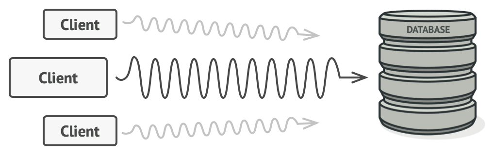
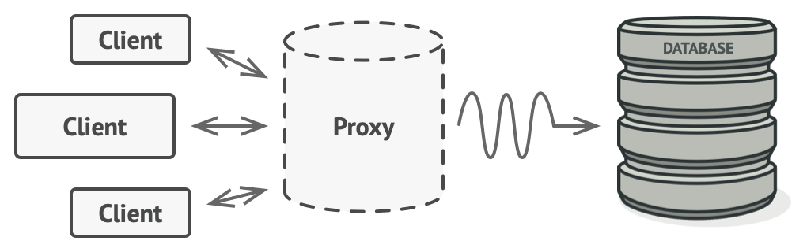
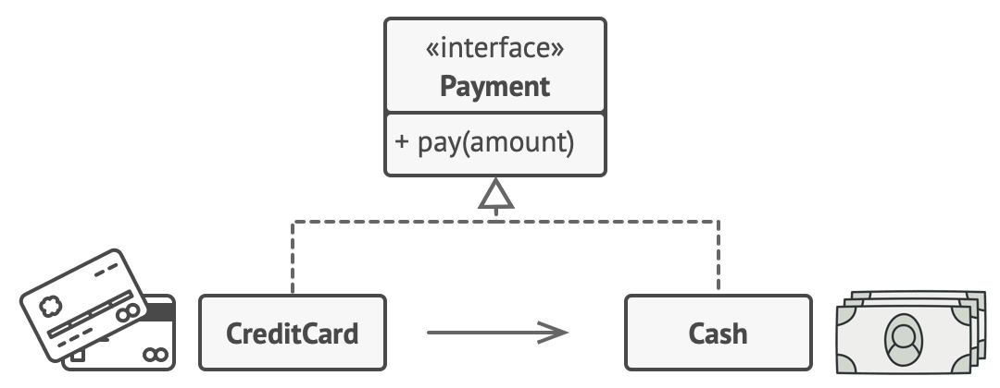
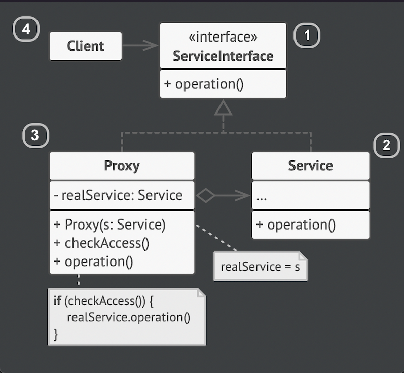
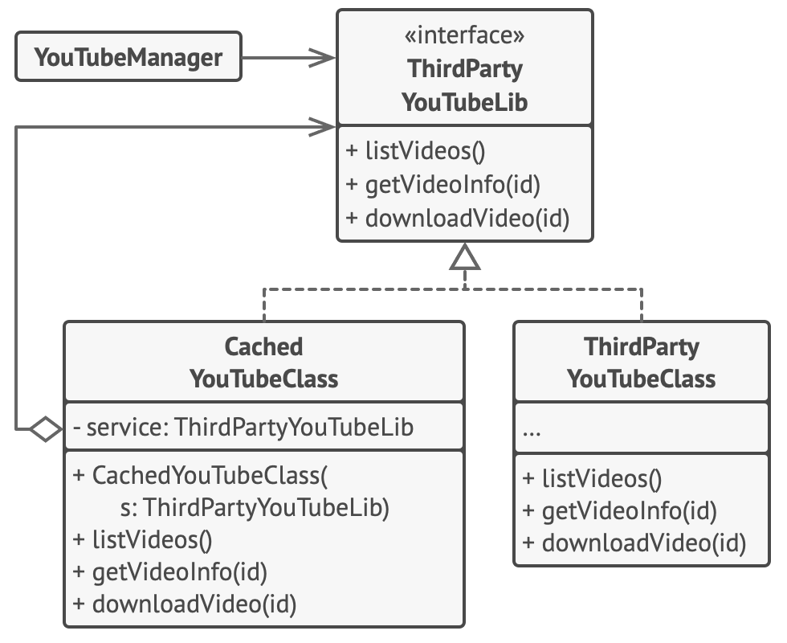

# Proxy

Lets you provide a substitute or placeholder for another object. A proxy control access
to the original object, allowing you to perform something either before or after the request gets through to the original object.

> Proxies delegate all the real work to some other object. Each proxy method should, in the end, refer to a service object 
    unless the proxy is a subclass of a service.

## Problem
Why would you want to control access to an object? 

You have a massive object that consumes a vast amount of system resources. You need it from time to time but not always.


You could implement lazy initialization: create the object only when it's needed. All of object's clients would need 
execute some deferred initialization code. Unfortunately this cloud cause a lot of duplicated code.

In an ideal scenario we would like to put this code directly into our object's class, but that isn't always possible. 
For instance, the class may be part of a closed 3rd-party library.

## Solution

The proxy pattern suggest that you create a new proxy class with the same interface as an original service object.
Then your update the app, so it passes the proxy object to all the original object's clients. 
Upon receiving a request from a client, the proxy creates a real service object and delegates all the work to it.



If you need to execute something either before or after the primary logic of the class, 
the proxy lets you do this without changing the class. Since the proxy implements the same interface as the original class, 
it can be passed to any client that expects a real service object.

## Analogy



A credit card is a proxy for a bank account, which is a proxy for a bundle of cash. Both implements the same interface: 
they can be used for making a payment. 

## Structure


1. The service interface declares the interface of the **Service**. The proxy must follow this interface to be able to disguise 
itself as a service object.
2. The **Service** is a class that provides some useful business logic.
3. The **proxy** class has a reference field that points to a service object. After the proxy finishes its processing 
(e.g., lazy initialization, logging, access control, caching, etc.). It passes the request to the service object.
Usually, proxies manage the full lifecycle of their service objects.
4. The **Client** should work with both services and proxies via the same interface. This way you can pass a proxy into any 
code that expects a service object.

## Pseudocode

Originally if the application requests the same video multiple times, the library just download it over and over, 
instead of caching and reusing.

The proxy class (**CachedYouTubeClass**) implements the same interface (**ThirdPartyYouTubeLib**) as the original downloader 
(**ThirdPartyYouTubeClass**), and delegates it all the work. However, it keeps track of the downloaded files and returns 
the cached result when the app requires the same video multiple times.

### The interface of a remote service
```
interface ThirdPartyYouTubeLib is
    method listVideos()
    method getVideoInfo(id)
    method downloadVideo(id)
```
### The concrete implementation of a service connector.
```
class ThirdPartyYouTubeClass implements ThirdPartyYouTubeLib is
    method listVideos() is
        // Send an API request to YouTube.

    method getVideoInfo(id) is
        // Get metadata about some video.

    method downloadVideo(id) is
        // Download a video file from YouTube.
```
### Proxy
```
// To save some bandwidth, we can cache request results and keep
// them for some time. But it may be impossible to put such code
// directly into the service class. For example, it could have
// been provided as part of a third party library and/or defined
// as `final`. That's why we put the caching code into a new
// proxy class which implements the same interface as the
// service class. It delegates to the service object only when
// the real requests have to be sent.
class CachedYouTubeClass implements ThirdPartyYouTubeLib is
    private field service: ThirdPartyYouTubeLib
    private field listCache, videoCache
    field needReset

    constructor CachedYouTubeClass(service: ThirdPartyYouTubeLib) is
        this.service = service

    method listVideos() is
        if (listCache == null || needReset)
            listCache = service.listVideos()
        return listCache

    method getVideoInfo(id) is
        if (videoCache == null || needReset)
            videoCache = service.getVideoInfo(id)
        return videoCache

    method downloadVideo(id) is
        if (!downloadExists(id) || needReset)
            service.downloadVideo(id)
```
### Class working directly with the service
```
// The GUI class, which used to work directly with a service
// object, stays unchanged as long as it works with the service
// object through an interface. We can safely pass a proxy
// object instead of a real service object since they both
// implement the same interface.
class YouTubeManager is
    protected field service: ThirdPartyYouTubeLib

    constructor YouTubeManager(service: ThirdPartyYouTubeLib) is
        this.service = service

    method renderVideoPage(id) is
        info = service.getVideoInfo(id)
        // Render the video page.

    method renderListPanel() is
        list = service.listVideos()
        // Render the list of video thumbnails.

    method reactOnUserInput() is
        renderVideoPage()
        renderListPanel()
```
### Application class: configure proxies on the fly
```
class Application is
    method init() is
        aYouTubeService = new ThirdPartyYouTubeClass()
        aYouTubeProxy = new CachedYouTubeClass(aYouTubeService)
        manager = new YouTubeManager(aYouTubeProxy)
        manager.reactOnUserInput()
```

## Applicability

- **Lazy initialization (virtual proxy).** This is when you have a heavyweight service object that wastes system resources 
by being always up, even though you only need it from time to time.

    > Instead of creating the object when the app launches, you can delay the object’s initialization to a time when it’s really needed.

- **Access control (protection proxy).** This is when you want only specific clients to be able to use the service object; 
for instance, when your objects are crucial parts of an operating system and clients are various launched applications 
(including malicious ones).

    > The proxy can pass the request to the service object only if the client’s credentials match some criteria.

- **Local execution of a remote service (remote proxy).** This is when the service object is located on a remote server.

    > In this case, the proxy passes the client request over the network, handling all the nasty details of working with the network.

- **Logging requests (logging proxy).** This is when you want to keep a history of requests to the service object.

     > The proxy can log each request before passing it to the service.

  - **Caching request results (caching proxy).** This is when you need to cache results of client requests and manage 
  the life cycle of this cache, especially if results are quite large.

       > The proxy can implement caching for recurring requests that always yield the same results. 
       The proxy may use the parameters of requests as the cache keys.